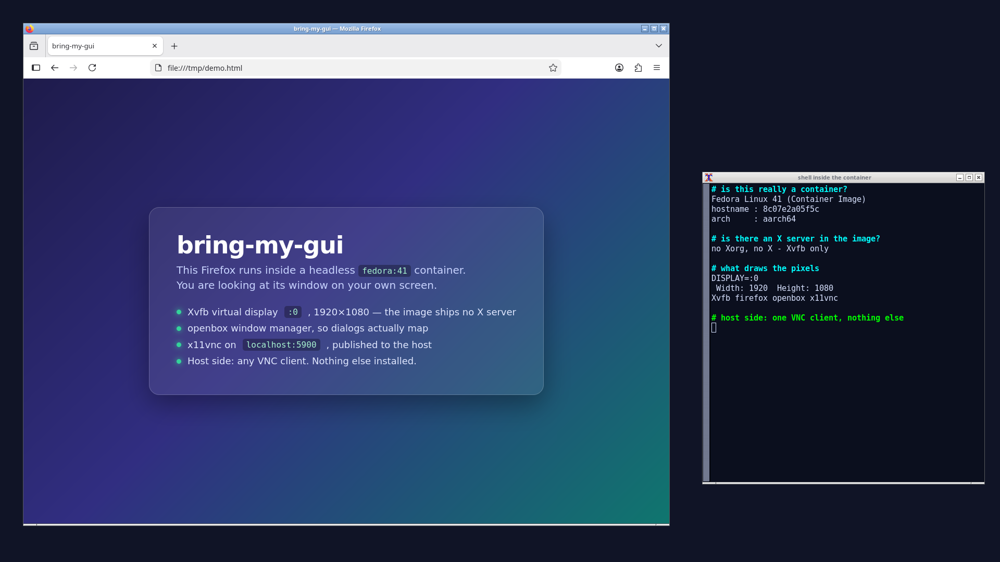
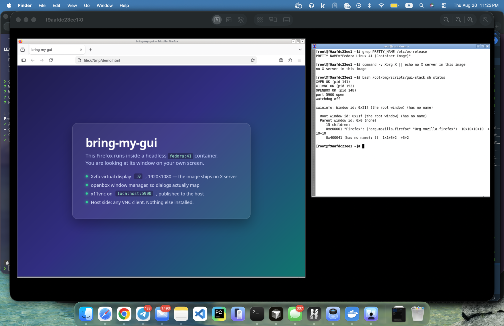

# bring-my-gui

[](https://github.com/Andy9542/bring-my-gui/actions/workflows/stack.yml)
[](LICENSE)

**English** | [Русский](README.ru.md)

Run a GUI app inside a headless Linux container and watch its window on your own screen.
The image needs no X server, no desktop environment and no changes: the stack
(**Xvfb + openbox + x11vnc**) is installed into whatever container you already
have, and on your side you only need a VNC client — macOS and most Linux
desktops ship one.



*Firefox inside `fedora:41` — an image that contains no X server at all. The
window on the right is a shell in that same container printing the proof. The
host has nothing installed but a VNC client. The page in the browser is a demo
page, so the screenshot labels its own moving parts.*

## Two ways to use it

**As an agent skill** — what it was built for. Your coding agent lives in a
container or sandbox, you ask it to show you a GUI, and it does the whole
job: installs the stack, picks a resolution that matches *your* screen,
launches the app with the right toolkit flags, hands you a connect string for
your OS, and already knows what to do when the picture flickers, the clipboard
is one-way or non-Latin keys start dropping.

**As plain bash scripts** — if you just want a GUI out of a container and no
agent is involved.

## Try it in one container

```bash
git clone https://github.com/Andy9542/bring-my-gui.git
cd bring-my-gui

# a container with no X server, VNC port published to your machine
docker run -d --name gui-demo -p 5900:5900 \
  -v "$PWD/skills/bring-my-gui:/opt/bmg:ro" fedora:41 sleep infinity

docker exec gui-demo bash -c '
  bash /opt/bmg/scripts/setup.sh &&
  RES=1440x900 VNC_PASS=demo bash /opt/bmg/scripts/gui-stack.sh start &&
  dnf install -y -q /usr/bin/xclock &&
  nohup env DISPLAY=:0 xclock -digital -update 1 >/dev/null 2>&1 &'
```

Then connect from your machine, password `demo`:

| Host OS | Connect |
|---|---|
| macOS | `open vnc://localhost:5900` (built-in Screen Sharing), or Finder → ⌘K |
| Windows | [TightVNC Viewer](https://www.tightvnc.com/download.php) or TigerVNC → `localhost:5900` |
| Linux | `vncviewer localhost:5900`, or Remmina |

Paste inside the session with **Ctrl+V** — the session is Linux, so ⌘V from a
Mac does not reach it. Done playing: `docker rm -f gui-demo`.

This is what it looks like on the other side — the same session captured on a
Mac, in the built-in Screen Sharing client. The window title is the container's
hostname and display, and the terminal on the right is `gui-stack.sh status`
running inside that container:



## Install it as a skill

```bash
# Cursor — as a plugin (manifest included)
git clone https://github.com/Andy9542/bring-my-gui.git ~/.cursor/plugins/local/bring-my-gui

# Cursor — just the skill
cp -r skills/bring-my-gui ~/.cursor/skills/

# Claude Code
cp -r skills/bring-my-gui ~/.claude/skills/
```

Any other agent: point it at
[`skills/bring-my-gui/SKILL.md`](skills/bring-my-gui/SKILL.md) and ask for a
GUI. Then say something like *"run the app from the sandbox on my screen,
I'm on a 14-inch MacBook"* — the screen size matters, it decides the
resolution and scale factor.

## Signing in to an app inside the container

The agent lives in the container. There is no browser. Desktop apps (Cursor,
Electron) try to launch one anyway — that is the case the bridge is for. A
shim answers as `xdg-open` / `x-www-browser` / `$BROWSER`, including when
the app calls `/usr/bin/xdg-open` by absolute path. The agent runs `watch`
and pastes the URL into the chat; you finish the login on the host.

```bash
docker exec gui-demo bash /opt/bmg/scripts/oauth-bridge.sh install
docker exec gui-demo bash /opt/bmg/scripts/oauth-bridge.sh watch   # prints the URL
```

Cursor polls for the token and signs itself in once you approve. Claude Code
prints a paste-code URL (and may also try a loopback callback on a random
port you cannot publish from inside) — open the printed URL, paste the code
back. Details: [SKILL.md § Browser login](skills/bring-my-gui/SKILL.md).

## What the skill knows that a fresh agent does not

Every item below was hit live, cost a debugging round, and is now one line in
the skill instead:

- **x11vnc exits the moment it starts** — sandbox images export
  `WAYLAND_DISPLAY`, x11vnc believes it is a Wayland session and refuses.
- **Non-Latin input dies, letter by letter, over time.** `setxkbmap us,ru`
  desyncs; `-add_keysyms` drifts and overwrites keycodes. The stack pre-loads
  the whole alphabet onto reserved keycodes instead — and the keysym range
  matters: clients send `0x01000000|unicode`, so `keycode N = 0x0435` creates a
  different, unmatched keysym and the "fix" only looks like it works.
- **The picture repaints constantly.** x11vnc's XDamage sanity check trips on
  Electron-style renderers and silently degrades to full-screen polling.
  Passing `-xdamage` twice keeps damage on.
- **All input freezes** with the log flooding *"waiting until all keys are
  up"* — a lost key release; `-R clear_all` cures it, `-skip_keycodes 184`
  prevents the macOS variant.
- **Blurry or tiny UI.** Screen resolution alone makes everything tiny, the
  app scale factor alone makes text blurry. You need `RES` = 2× the host's
  logical resolution *and* the toolkit's scale flag.
- **Electron and Qt apps that install fine and start never** — the missing
  `.so` from `ldd` is a package search on *this* distro, not a Debian name
  remembered from another one.
- **`pkill -f x11vnc` kills your own shell**, because the pattern matches its
  command line too.
- **A browser shim that fork-bombs the container** — `xdg-open`'s own fallback
  chain calls `x-www-browser`, so a shim registered as both bounces between
  them until the PID table is gone. The bridge carries a depth guard, and the
  cleanup order matters: remove the shim first, kill second.

Full list with symptoms and fixes:
[`references/gotchas.md`](skills/bring-my-gui/references/gotchas.md).

## Install by binary, not by package name

The stack is a set of programs — `Xvfb`, `x11vnc`, `openbox`, `setxkbmap`,
`xwininfo` — and their package names differ per distro, split between
releases, and get renamed. `setup.sh` therefore asks the local package index
which package ships `/usr/bin/<binary>` and installs that, so the same script
works on apt, dnf, yum and apk without a hardcoded list.

## Tested on

CI runs the whole path on every push and weekly (distro packages get renamed —
the weekly run is how we find out). Each job installs the stack from a clean
image, starts the display, asserts the VNC port answers with an RFB handshake
through the published port, and uploads a screenshot captured by a real VNC
client. That paid off immediately: the first version of the workflow asked
Fedora for `xorg-x11-apps` and got nothing, because Fedora 41 split `xclock`
into its own package. The demo app is installed by binary now, like everything
else here.

| Image | Cold install | Notes |
|---|---|---|
| `ubuntu:24.04` | ~2.5 min | the file index (`apt-file`) is downloaded once, to resolve the last binaries |
| `debian:bookworm-slim` | ~2.5 min | same |
| `fedora:41` | ~3.5 min | `autocutsel` is not packaged; x11vnc still exchanges the clipboard with your client |
| `alpine:3.21` | ~1.5 min | ships only `sh`, so `apk add bash` comes first |

(Measured with four containers installing in parallel on a laptop; a single one
is faster.)

Developed on arm64 (Apple silicon), CI runs amd64.

## What it is not

- **No audio.** VNC carries pixels and input only. A video plays and stays
  silent, and no flag changes that.
- **Not for the internet.** VNC is plaintext and the password is a
  convenience lock. The intended topology is container → published port →
  the same machine. If it ever has to cross a network, tunnel it over SSH.
- **Not Wayland.** The app runs on X11 inside the container, which is exactly
  why `WAYLAND_DISPLAY` gets unset.
- **Not a desktop image.** Nothing is replaced — the stack is added to the
  container you already run.

## Why not X11 forwarding, xpra or a desktop image?

- **Mounting the host X socket** (`-v /tmp/.X11-unix`) needs an X server on
  the host: macOS and Windows have none, and on Linux it hands the container
  your whole X session.
- **`xpra`** is a better protocol for single windows, but it has to be
  installed on both ends; here the host side is a VNC client you already have.
- **Ready-made desktop-in-a-container images** work well — if you can switch
  to their image. This adds a display to the image your agent is already
  running in.
- **noVNC / websockify** is a fine addition when you want a browser instead of
  a VNC client; it sits on top of the same X stack this skill sets up.

## Repo layout

```
skills/bring-my-gui/
  SKILL.md                 the skill: decisions, flags, checklists
  references/gotchas.md    symptom → cause → fix, all live-debugged
  scripts/setup.sh         installs the stack by binary (apt/dnf/yum/apk)
  scripts/gui-stack.sh     start | stop | restart | status
  scripts/oauth-bridge.sh  browser login without a browser: install | watch | listen
```

## License

MIT — see [LICENSE](LICENSE). Issues and PRs welcome, especially "it broke on
distro X" reports with the log.

## Keywords

GUI forwarding from a headless container, run a GUI app in Docker, see a
container window on the host, X11 in Docker without an X server, fix
`cannot open display`, virtual display for a headless Linux box, Xvfb, x11vnc,
openbox, autocutsel, VNC into a Docker container, Docker Sandbox / `sbx` GUI,
remote desktop for a dev sandbox, run Firefox / Chromium / Electron in a
container and see the window, Electron `--no-sandbox` in Docker,
`WAYLAND_DISPLAY` unset, `DISPLAY=:0`, macOS Screen Sharing, TightVNC,
TigerVNC, Remmina, agent skill, Cursor skill, Claude skill, OAuth login from a
container with no browser, `xdg-open` handoff to the host browser, sign in to
Cursor inside Docker, Claude Code login on a headless box.
